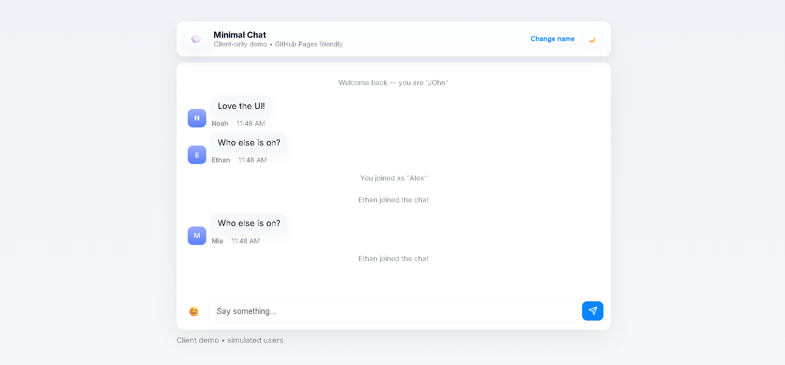

# 💬 client-side-chat-simulator

A clean, client-only chat demo that simulates real-time conversation — built with pure HTML, CSS, and JavaScript.  
No backend, no dependencies, and fully GitHub Pages–ready.

---

## ✨ Features

- 🧑‍💬 Local username (saved via localStorage)
- 🕓 Auto timestamps
- 🤖 Simulated chat users with join/leave messages
- 💡 Light / Dark theme toggle
- 🔔 Soft notification sound
- 😊 Quick emoji insert
- 🔄 Smooth scroll and new message indicator
- 📱 Fully responsive modern UI

---

## 🧩 Tech Stack

- **HTML5** for structure  
- **CSS3 (Custom properties + responsive)** for Apple-like UI  
- **Vanilla JavaScript (ES6)** for interactivity and local logic  
- **No external libraries** — lightweight and portable  

---

## 🚀 How to Run

1. Clone or download this repo
